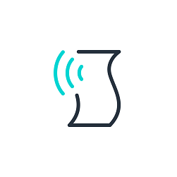

#  Coding Challenges

Welcome to the careers repository for Streeva, to see what positions we currently have open please visit [our careers page](https://streeva.com/careers/)

We understand interviews themselves can be stressful and don't always allow you to present your capabilities as well as you might prefer, to try and help with this part of our interview process involves a "take-home" code challenge.  These tasks are designed to not require more than 2-3 hours to complete but you are free to spend as much time as you would like on them.

For the coding challenge for the position relevant to you:

* [Frontend Engineer](frontend.engineer/)
* [Core Engineer](core.engineer/)

Please submit your solutions to careers@streeva.com

Things to include in your submission:

1. Source code, or details of how to access your solution (such as drop box, or github links)
2. An outline of how long it took you to reach your solution